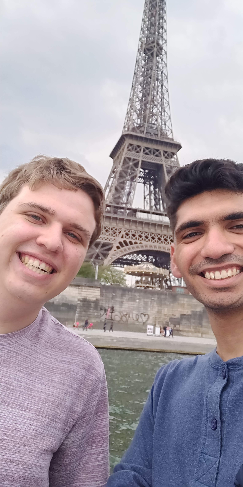

I am originally from Russellville, Alabama, and did my undergraduate studies in Computer Engineering at Auburn University, Alabama. Currently, I am pursuing a PhD in Computer Science with a focus on  the applications of machine learning to Proteins at Virginia Tech. In my free time, I enjoy biking, cooking, playing piano, making coffee/espresso, 3D printing, and gaming. One of my most memorable experiences was going on a backpacking trip across Europe with some of my best friends, where we visited Paris, London, Rome, and Naples.

### Research Interests/Focus:
*   Protein Folding
*   Template Based Modeling
*   Protein Alignments via Deep Neural Networks 
*   Protein Folding Visualization/Interaction
    - PolyFoldAI: An AI assisted protein folding visualization tool 

### Experience:

#### Bhattacharya Lab Research Assistant ***(Jan. 2021 - Present)*** 

-   Explored the current space in Deep Reinforcement Learning
-   Lead conversion of PolyFold to Python to add AI/ML for protein structure prediction
-   Involved in 

#### HudsonAlpha BioTrain Internship ***(June - July 2020)***
-   Researched existing models for machine learning regression in Python
-   Implemented various models to predict alignment coverage on DNA sequences
-   Developed skills in writing documentation, specifically: Standard Operating Procedures and Validation Plans
